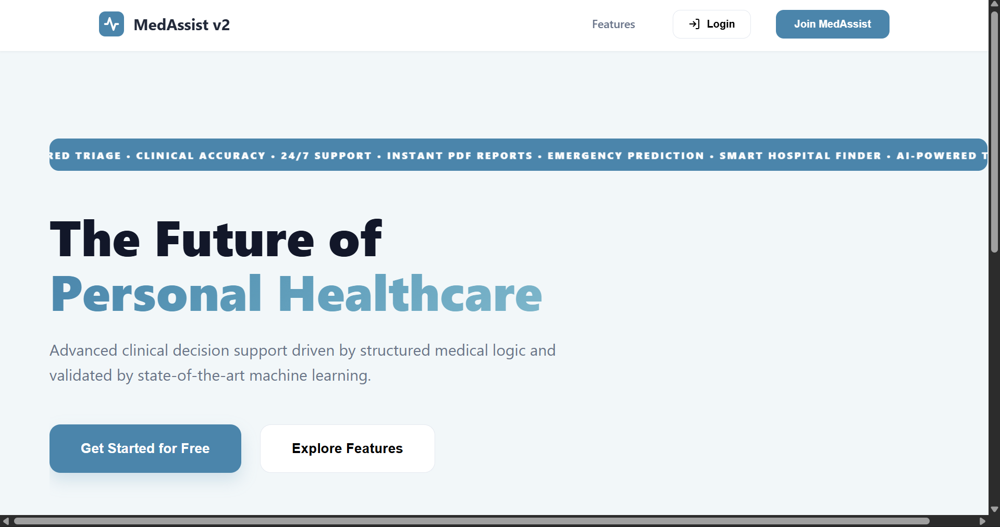
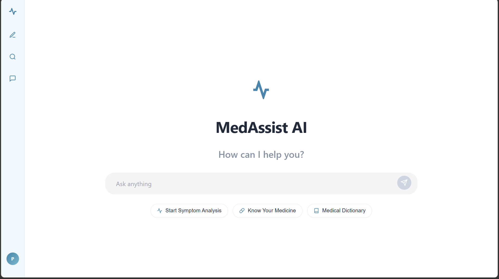
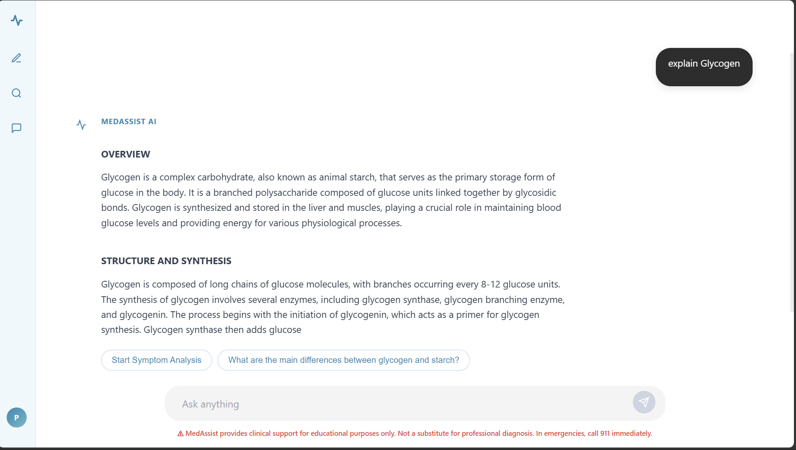
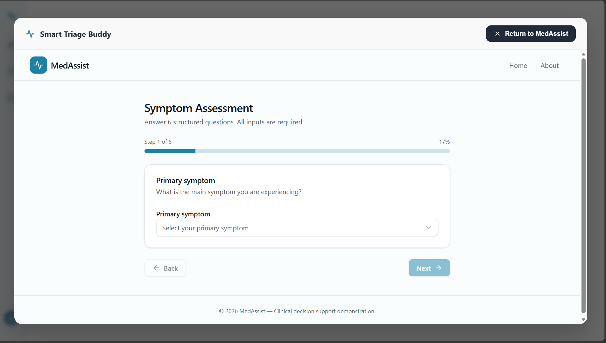
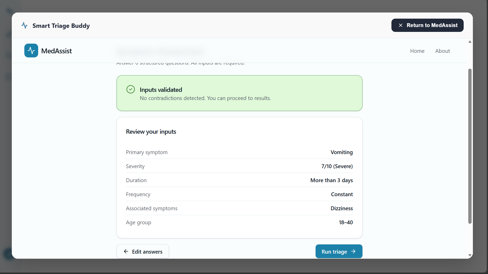
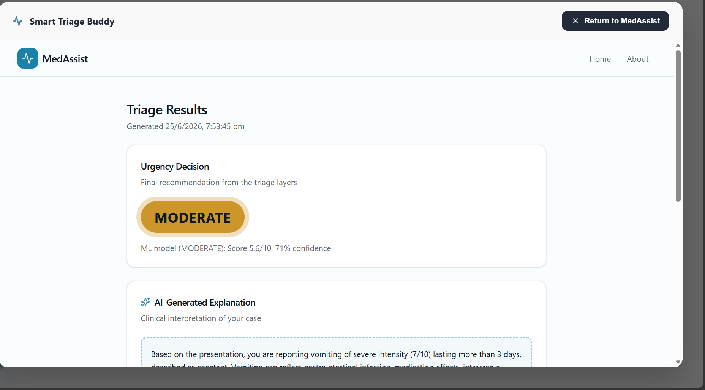
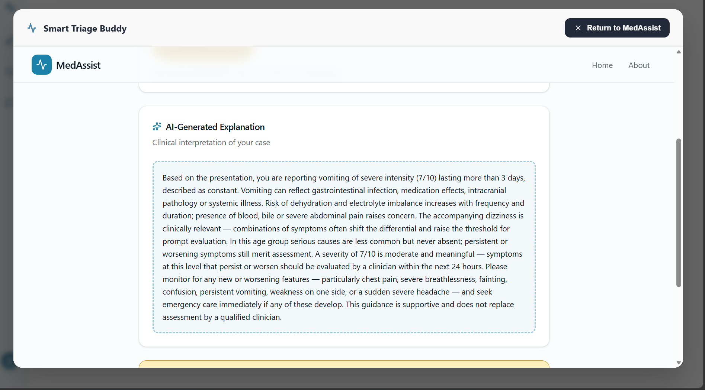
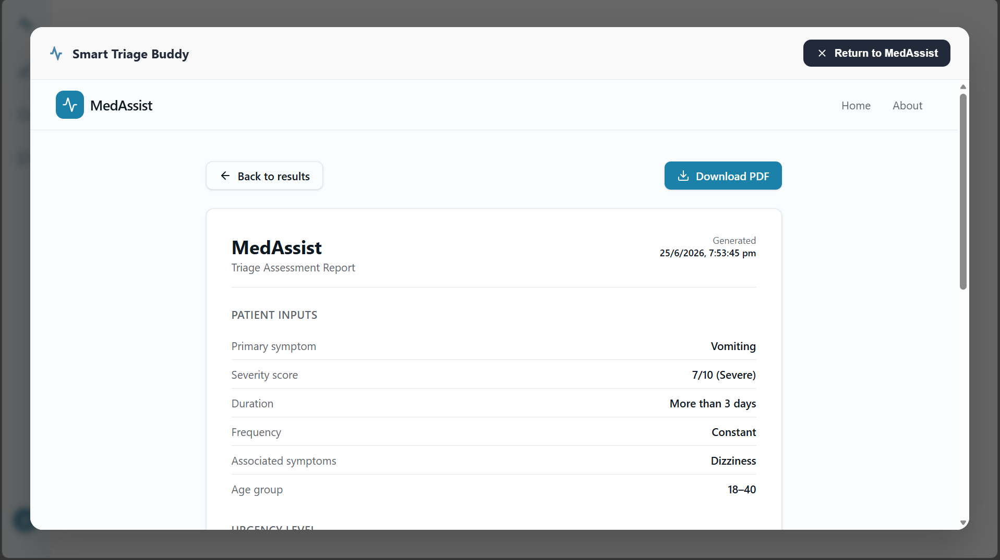
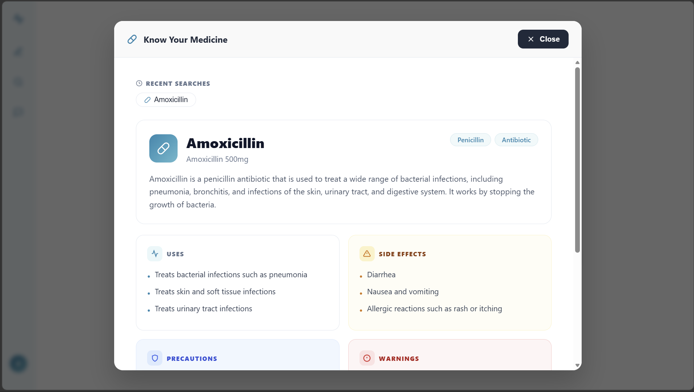
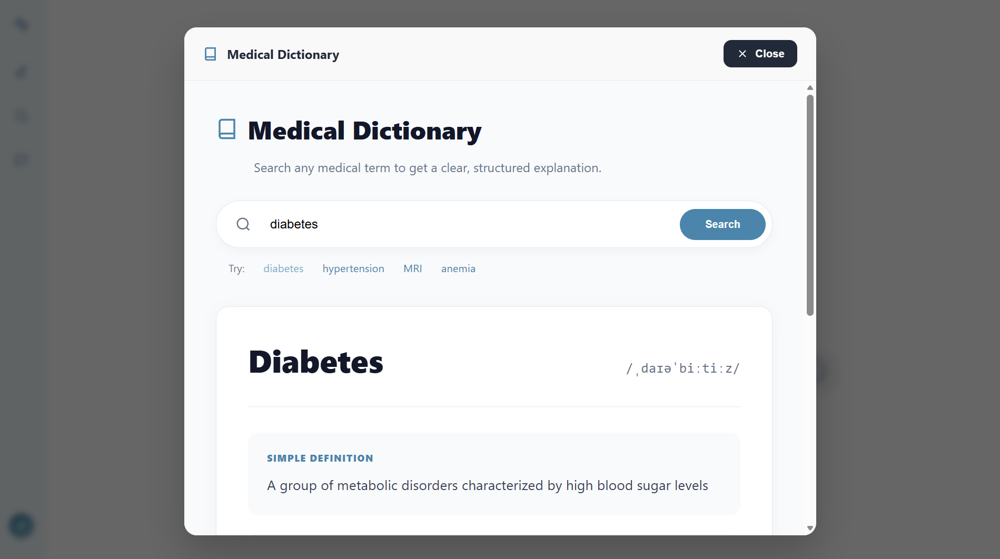

<h1 align="center">MedAssist v2 — Clinical Triage & Decision Support System</h1>

<p align="center">
  <em>Structured clinical triage engineered with a dedicated multi-API pipeline — safety-first, not chatbot-first.</em>
</p>

<p align="center">
  <a href="https://huggingfacesan-medassist.hf.space/"></a>
  
  
  
  
  
  <a href="./LICENSE"></a>
</p>

> ⚠️ **MedAssist v2 is a clinical decision support demonstration.** It is designed for triage assistance only, not diagnosis or treatment. Always consult a qualified healthcare provider for any medical concerns.

---

## Table of Contents

- [Overview](#overview)
- [Key Differentiator — Multi-API Pipeline Architecture](#key-differentiator--multi-api-pipeline-architecture)
- [Screenshots](#screenshots)
- [Features](#features)
- [System Architecture](#system-architecture)
- [Tiered Decision Engine](#tiered-decision-engine)
- [Tech Stack](#tech-stack)
- [Project Structure](#project-structure)
- [Getting Started](#getting-started)
- [Results & Metrics](#results--metrics)
- [Roadmap](#roadmap)
- [Disclaimer](#disclaimer)
- [License](#license)

---

## Overview

**MedAssist v2** is a full-stack Clinical Decision Support System (CDSS) that combines a deterministic rule engine, a machine learning validation layer, and an LLM interaction layer to perform structured health triage. Users answer 6 guided clinical questions, the system runs them through a hybrid decision pipeline, and delivers a colour-coded urgency verdict (High / Moderate / Low) with an AI-generated clinical explanation and a downloadable PDF report.

Unlike typical AI health chatbots that send everything to a single LLM API call and hope for the best, MedAssist v2 uses a **dedicated multi-API pipeline** — each task in the clinical workflow (intake validation, ML scoring, explanation generation, medicine lookup, medical dictionary) is handled by its own isolated API request with its own token budget, system prompt, and failure boundary. This makes the system significantly more reliable, auditable, and cost-efficient than a monolithic LLM approach.

> Deployed live on **HuggingFace Spaces**: [huggingfacesan-medassist.hf.space](https://huggingfacesan-medassist.hf.space/)

---

## Key Differentiator — Multi-API Pipeline Architecture

Most AI health apps use a single LLM API call for everything — the model is expected to triage, explain, look up medicines, define terms, and manage conversation flow all at once. This creates unpredictable token usage, context bleed between tasks, and a single point of failure.

MedAssist v2 solves this with **5+ dedicated API pipelines**, each with a specific clinical responsibility:

| Pipeline | Trigger | Model / Service | Token Budget | Responsibility |
|---|---|---|---|---|
| **Triage Explanation** | After ML scoring | Grok API (LLM) | Focused | Generate clinical explanation of urgency decision |
| **Symptom Analysis Chat** | Free-text query | Grok API (LLM) | Conversational | Structured symptom discussion and context |
| **Know Your Medicine** | Drug name input | Grok API (LLM) | Reference | Drug profile: uses, side effects, precautions, warnings |
| **Medical Dictionary** | Term search | Grok API (LLM) | Lookup | Definition, pronunciation, clinical context |
| **ML Triage Scoring** | After 6-step intake | Scikit-learn MLP | N/A (local) | Urgency score + confidence from clinical features |
| **Input Validation** | Pre-triage | Rule Engine (Python) | N/A (logic) | Contradiction detection, completeness check |
| **PDF Generation** | Post-triage | ReportLab (local) | N/A (local) | Structured clinical report generation |

**Why this matters:**

- Each API call has a tightly scoped system prompt — no context bleed between triage logic and chat responses
- Token costs are predictable and bounded per task, not unbounded per session
- If one pipeline fails (e.g. medicine lookup), the rest of the app continues working — no cascading failure
- Each pipeline can be upgraded, swapped, or fine-tuned independently
- The ML model and rule engine run locally — zero AI token cost for the core triage decision

---

## Screenshots

### 🌐 Landing Page
> "The Future of Personal Healthcare" — marquee feature strip: AI triage, PDF reports, emergency prediction, hospital finder.

<p align="center">
  
</p>

---

### 🔐 Login
> Clean authentication with Supabase — email/password with sign up flow.


---

### 💬 AI Chat Interface
> Main dashboard — Start Symptom Analysis, Know Your Medicine, Medical Dictionary quick-start prompts.

<p align="center">
  
</p>

---

### 🧠 AI Response — Medical Dictionary in Chat
> Structured AI response to "explain Glycogen" — formatted with Overview and Structure sections.

<p align="center">
  
</p>

---

### 📋 Smart Triage Buddy — 6-Step Intake
> Guided symptom assessment — Step 1 of 6 with progress bar (17%). Primary symptom selection.

<p align="center">
  
</p>

---

### ✅ Input Review & Validation
> Pre-triage review — all 6 inputs shown with "Inputs validated / No contradictions detected" confirmation before running.

<p align="center">
  
</p>

---

### 🚦 Triage Result — Urgency Decision
> ML model output: **MODERATE** — Score 5.6/10, 71% confidence. Timestamped result from the hybrid decision engine.

<p align="center">
  
</p>

---

### 📝 AI-Generated Clinical Explanation
> LLM-generated interpretation of the case — references severity (7/10), duration (3+ days), associated symptoms (dizziness), age group, and warning signs to watch for.

<p align="center">
  
</p>

---

### 📄 PDF Triage Report
> Downloadable clinical report — patient inputs, urgency level, timestamps. Generated via ReportLab with no external service.

<p align="center">
  
</p>

---

### 💊 Know Your Medicine
> Drug profile for Amoxicillin 500mg — uses, side effects, precautions, warnings — powered by dedicated medicine lookup API pipeline.

<p align="center">
  
</p>

---

### 📖 Medical Dictionary
> Instant medical term lookup with pronunciation, simple definition, and clinical context. Shown: Diabetes with IPA transcription.

<p align="center">
  
</p>

---

## Features

| Feature | Description |
|---|---|
| 🏗️ **Hybrid triage engine** | Rule engine (primary) + ML MLP classifier (secondary) — deterministic safety layer first, AI second |
| 🔀 **5+ dedicated API pipelines** | Each clinical task has its own isolated API call, system prompt, and token budget |
| 📋 **6-step guided intake** | Structured clinical questionnaire: symptom, severity (1–10), duration, frequency, associated symptoms, age group |
| ✅ **Input validation** | Pre-triage contradiction detection — flags inconsistent or incomplete inputs before running ML |
| 🚦 **3-tier urgency scoring** | High / Moderate / Low with confidence score and ML score out of 10 |
| 🧠 **AI clinical explanation** | LLM-generated case interpretation scoped to the specific triage result |
| 📄 **PDF report generation** | Downloadable clinical report via ReportLab — no external service, runs locally |
| 💊 **Know Your Medicine** | Drug lookup with uses, side effects, precautions, warnings |
| 📖 **Medical Dictionary** | Searchable medical term definitions with pronunciation |
| 💬 **AI health chat** | Free-text clinical Q&A with structured formatting |
| 🔐 **Authentication** | Supabase email/password auth with secure session management |
| 🌐 **Cloud deployed** | Live on HuggingFace Spaces |

---

## System Architecture

```
┌─────────────────────────────────────────────────────────────────────┐
│                         React Frontend (TypeScript)                  │
│                                                                      │
│  Landing → Login (Supabase) → Dashboard                             │
│       │                           │                                  │
│       │              ┌────────────┴──────────────┐                  │
│       │              │                           │                  │
│   AI Chat        Smart Triage Buddy          Tools Panel            │
│  (free-text)    (6-step guided intake)    (Medicine / Dictionary)   │
└──────┬───────────────┬───────────────────────────┬──────────────────┘
       │               │                           │
       │    HTTP POST  │                HTTP POST  │
       ▼               ▼                           ▼
┌─────────────────────────────────────────────────────────────────────┐
│                        FastAPI Backend (Python)                      │
│                                                                      │
│  ┌──────────────────────────────────────────────────────────────┐   │
│  │                  Multi-API Pipeline Router                    │   │
│  │                                                              │   │
│  │  /chat       → Symptom Analysis Pipeline  → Grok API        │   │
│  │  /triage     → Rule Engine                                   │   │
│  │               → ML MLP Classifier (local, scikit-learn)      │   │
│  │               → Explanation Pipeline     → Grok API         │   │
│  │  /medicine   → Medicine Lookup Pipeline  → Grok API         │   │
│  │  /dictionary → Dictionary Pipeline       → Grok API         │   │
│  │  /report     → PDF Generator             → ReportLab (local)│   │
│  └──────────────────────────────────────────────────────────────┘   │
│                                                                      │
│  Auth: Supabase JWT validation on protected routes                  │
└──────────────────────┬──────────────────────────────────────────────┘
                       │
         ┌─────────────┴──────────────┐
         │                            │
         ▼                            ▼
┌─────────────────┐        ┌──────────────────────┐
│  Grok API       │        │  Local Services       │
│  (LLM layer)   │        │                       │
│                 │        │  Scikit-learn MLP     │
│  4 isolated     │        │  (triage scoring)     │
│  pipelines,     │        │                       │
│  each scoped    │        │  ReportLab            │
│  system prompt  │        │  (PDF generation)     │
└─────────────────┘        │                       │
                           │  Clinical Rule Engine │
                           │  (Python logic)       │
                           └──────────────────────┘
```

---

## Tiered Decision Engine

The core triage decision is deliberately **not** left to an LLM. It goes through three layers in sequence:

```
User completes 6-step intake
          │
          ▼
┌─────────────────────────────┐
│   Layer 1: Rule Engine      │  ← Hard-coded clinical logic
│   (Python)                  │    "Severity ≥ 8 + duration > 3d = HIGH"
│                             │    Contradiction detection
│   Output: Candidate urgency │
└─────────────┬───────────────┘
              │
              ▼
┌─────────────────────────────┐
│   Layer 2: ML Classifier    │  ← MLP trained on clinical symptom data
│   (Scikit-learn)            │    Input: symptom, severity, duration,
│                             │           frequency, associated sx, age
│   Output: Score/10 +        │    Output: Urgency class + confidence %
│           Confidence %      │
└─────────────┬───────────────┘
              │
              ▼
       Both agree? → Final verdict
       Conflict?   → Conservative (higher urgency wins)
              │
              ▼
┌─────────────────────────────┐
│   Layer 3: LLM Explanation  │  ← Grok API (dedicated pipeline)
│   (Grok API)                │    System prompt scoped to explanation only
│                             │    Input: verdict + all patient inputs
│   Output: Clinical summary  │    Output: Natural language interpretation
│   for the user              │
└─────────────────────────────┘
```

---

## Tech Stack

| Layer | Technology |
|---|---|
| **Frontend** | React 17, TypeScript, Vite, Vanilla CSS (custom design system), Lucide React |
| **Backend** | Python, FastAPI, Uvicorn (ASGI) |
| **Authentication** | Supabase (email/password, JWT) |
| **ML Model** | Scikit-learn MLP Classifier (trained on clinical symptom dataset) |
| **LLM / AI** | Grok API — 4 dedicated pipelines (chat, triage explanation, medicine, dictionary) |
| **PDF Generation** | ReportLab (local, no external service) |
| **Deployment** | HuggingFace Spaces |
| **Database** | Supabase (PostgreSQL) |

---

## Project Structure

```
MedAssist-v2/
│
├── README.md
├── LICENSE
│
├── frontend/
│   ├── src/
│   │   ├── components/
│   │   │   ├── LandingPage.tsx
│   │   │   ├── Login.tsx
│   │   │   ├── ChatInterface.tsx      # AI chat — Symptom Analysis pipeline
│   │   │   ├── SmartTriageBuddy.tsx  # 6-step intake flow
│   │   │   ├── TriageResult.tsx       # Urgency display + AI explanation
│   │   │   ├── PDFReport.tsx          # Report preview + download
│   │   │   ├── MedicinePanel.tsx      # Know Your Medicine pipeline
│   │   │   └── DictionaryPanel.tsx   # Medical Dictionary pipeline
│   │   ├── hooks/
│   │   │   ├── useTriage.ts
│   │   │   └── useChat.ts
│   │   └── App.tsx
│   └── package.json
│
├── backend/
│   ├── main.py                        # FastAPI app + multi-pipeline router
│   ├── rule_engine.py                 # Clinical rule logic (Layer 1)
│   ├── ml_classifier.py              # MLP scoring (Layer 2)
│   ├── llm_pipelines.py              # 4 dedicated Grok API pipelines (Layer 3)
│   ├── pdf_generator.py              # ReportLab report builder
│   └── requirements.txt
│
├── models/
│   └── triage_mlp.pkl                # Pre-trained MLP classifier
│
├── data/
│   ├── clinical_rules.json           # Rule engine definitions
│   └── symptom_dataset.csv          # Training data for ML model
│
├── scripts/
│   └── train_model.py                # MLP training script
│
└── screenshots/                      # README screenshots
```

---

## Getting Started

### Prerequisites

- Python 3.8+
- Node.js 16+
- Supabase project (free tier)
- Grok API key

### 1. Backend setup

```bash
cd backend
pip install -r requirements.txt

# Create .env
SUPABASE_URL=your_supabase_url
SUPABASE_KEY=your_supabase_key
GROK_API_KEY=your_grok_api_key

python main.py
```

### 2. Frontend setup

```bash
cd frontend
npm install
npm run dev
```

Visit `http://localhost:5173` or use the live deployment at [huggingfacesan-medassist.hf.space](https://huggingfacesan-medassist.hf.space/)

### 3. Train the ML model (optional)

```bash
cd scripts
python train_model.py
# Saves triage_mlp.pkl to ../models/
```

---

## Results & Metrics

| Metric | Value |
|---|---|
| Triage intake steps | 6 structured questions |
| Decision layers | 3 (Rule Engine → ML → LLM explanation) |
| Dedicated API pipelines | 5+ (chat, explanation, medicine, dictionary, validation) |
| ML model type | MLP Classifier (Scikit-learn) |
| Urgency levels | High / Moderate / Low |
| ML confidence (sample) | 71% (Moderate — Vomiting 7/10, 3+ days) |
| PDF generation | Local (ReportLab) — zero external service cost |
| Deployment | HuggingFace Spaces (live) |
| Auth provider | Supabase |
| LLM provider | Grok API |

---

## Roadmap

- [ ] **Hospital finder** — geolocation-based nearest emergency facility lookup
- [ ] **Emergency detection** — auto-escalation for red-flag symptoms (chest pain, stroke signs)
- [ ] **Voice input** — speech-to-text for symptom intake
- [ ] **Session history** — persistent triage history per user account
- [ ] **Multi-language support** — localised clinical explanations
- [ ] **Wearable integration** — import heart rate / SpO2 from Apple Health / Google Fit
- [ ] **Clinician dashboard** — anonymised aggregate triage data for healthcare providers
- [ ] **Fine-tuned ML model** — retrain MLP on larger clinical datasets (MIMIC-III)

---

## Disclaimer

**MedAssist v2 is a clinical decision support demonstration.** It is designed for triage assistance only. It does not provide diagnoses, prescriptions, or treatment plans. In any emergency, call your local emergency services immediately. Always consult a qualified healthcare provider for medical concerns.

---

## License

This project is licensed under the **MIT License** — see the [LICENSE](./LICENSE) file for details.

---

## Author

**Sanjeev A**  
B.Tech Computer Science (Data Science) — SRMIST Kattankulathur

[](https://github.com/sa1165)
[](https://huggingfacesan-medassist.hf.space/)

---

<p align="center">
  <sub>Built with 🏥 FastAPI + React + Scikit-learn + Grok API — <em>because clinical safety needs more than one layer.</em></sub>
</p>
